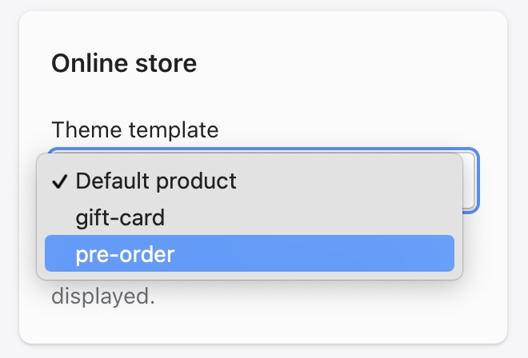

# Adding a new product

## Title

Add the title of the product

***
## Description

Fill in the product description.

***
## Media

Add the product images here. Images for all products should be `1200x1700px`.

```md
**Remember** to add product images in this order:
1. Image flat (this will be the image that shows up in collection pages)
2. Model image (this will be the image that shows when someone hovers over the product on collection pages)
3. Any other images
```

***

## Product Type

Every product must use of the product types we use across the SIRPLUS store. This is really important for product filtering, and as with colours, try to keep it as high-level as possible.


## Pricing

Info to be added 

***
## Inventory

Info to be added

***
## Shipping

Info to be added

***
## Options

Adding variant options to your product is **very important**. Variant info is what the collection pages use to create product filters.

### Size option

All products must have a size. Size should always be the first option you create

1. Create the option. Call it `Size` (with a capital).

2. Add all the options there are for that product. Sizes should either be in acronyms (`XS`, `S`, `M`, `L`, `XL` etc.) or numbers.

!> For products that only have one size, it **must** be called `One Size` rather than "O/S", "OS" or anything else.

***
### Colour option

All products must have a colour. Colour should always be the second option you create.

1. Create the option. Call it `Colour` (make sure this is the British spelling with a 'U').

2. Add the colour for that product.

!> Colours should always be as simple as possible, to make sure that as many products near to that colour show up. Stick to primary and secondary colours wherever possible. (Eg. Navy should be `Blue` and Maroon should be `Red`.)

?> Anything that is off-white like Stone, Sand, Oatmeal etc should be called `Beige`

***
## SEO

Info to be added

***
## Metafields

You should add product metafields to the product if you want to show certain information on the product's page:


### Custom Product Label

Add some text here if you want to add a custom label for the product when it shows on collection pages.

!> You should use labels sparingly. If there are too many their effect will be reduced and the aesthetic of the website will be damaged.

### Model & Fit

Choose which model & fit information to show for this product by selecting the right page. If the page doesn't exist yet, you can create it [using this guidance](/sizing.md).

### Buy it with

You can choose a product to advertise with the product you're uploading.

***
## Tags

You do not need to add any tags to the product any longer.

## Pre-order

If the product is on pre-order then change the product template to `Pre-Order`.

You will need to manually set a reminder to change this back to the default template on the right date, **this will not happen automatically**.

?> If a product is set to pre-order then this will override the Custom Product Label set in the metafields to show `Pre-Order` instead.

